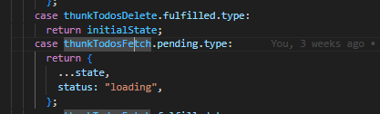
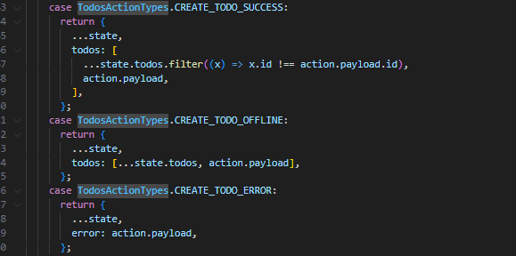
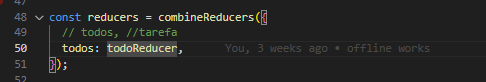
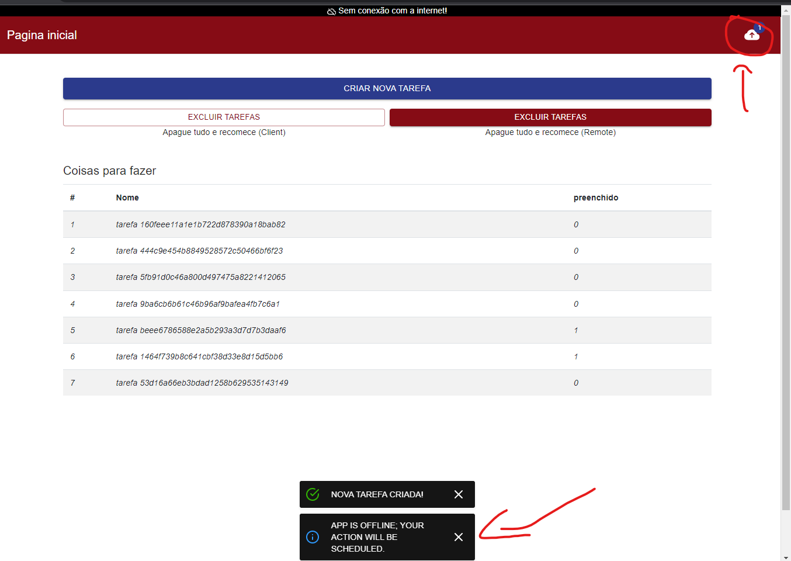

## Main Changes

So first i've detect that you are not using redux-saga, redux-offline no have compatibility with new RTK Query redux ( slice and other stuffs ) but we can merge the both as i did on the project

[You read more here about Redux Saga](https://redux-saga.js.org/)

When internet goes down and app detect that, we start a timeout function with redux saga to periodic check when internet get back, when detect online again that timeout function stop running.

## How to create a new offline redux

You just need to create all described bellow items to post functions where you need to save at outbox, any others offline functions you just do what you already know and then it will be persisted, i mean about you not need redux-saga for get operations

### 1. Creates a action-type

[Action Types Folder](./src/store/action-types)

```ts
export const TodosActionTypes = {
  CREATE_TODO_STARTED: "[TODO] CREATE_TODO_STARTED",
  CREATE_TODO_SUCCESS: "[TODO] CREATE_TODO_SUCCESS",
  CREATE_TODO_ERROR: "[TODO] CREATE_TODO_ERROR",
  CREATE_TODO_OFFLINE: "[TODO] CREATE_TODO_OFFLINE",
};
```

A good practise, never forget to export at [index.js](./src/store/action-types/index.js)

```ts
export * from "./network";
export * from "./todos";
```

### 2. Create Async Thunk to dispatch Action

[Slice Folder](./src/store/slices)

```ts
export const thunkTodosFetch = createAsyncThunk("todos/fetch", async () => {
  const { data } = await axios.get(`${endPoint}/todos`);
  return data;
});
```

A good practise, never forget to export at [index.js](./src/store/slices/index.js)

```ts
import queuesSlice from "./queues";
import todosSlice from "./todos";

export default [todosSlice, queuesSlice];
```

### 3. Create a Redux Sagas

Here you need to take a look at given example [Todo Sagas](./src/store/sagas/todos/index.js)

Inside [Todo Folder](./src/store/sagas/todos)

We've three files:

### [Reducer - reducer.js](./src/store/sagas/todos/reducer.js)

- Here you add your reducer configuration, when you are using sagas you must not create a slice reducer, you need to use like given example so i've merged slice actions with redux saga actions.

#### Slice Actions at Redux Saga Reducer



#### Reducer for Redux Saga Action Keys



Also you _MUST_ need to register your redicer at [index.js](./src/store/index.js)



### [Sagas - create-todo.js](./src/store/sagas/todos/create-todo.js)

- Here you add your custom execute functions, and run any function that you need to run
- Importante to know: that file uses [_Generator Functions_](https://developer.mozilla.org/en-US/docs/Web/JavaScript/Reference/Statements/function*)

NEVER FORGET TO REGISTER Redux Saga Operation at both files
[your-reducer/index.js](./src/store/sagas/todos/index.js)
[index.js](./src/store/sagas/index.js)

You had three options to register when redux saga will run, you read more here
[Take Every](https://redux-saga.js.org/docs/api/#takeeverychannel-saga-args)
[Take Latest](https://redux-saga.js.org/docs/api/#takelatestpattern-saga-args)
[Take Leading](https://redux-saga.js.org/docs/api/#takeleadingpattern-saga-args)

Almost time you will use Take Latest, and some specific cases a Take Every.

### 4. Dispatch a Redux Function

So when you need to dispatch a function you will call redux hook `const dispatch = useDispatch();`

Dispatch example [Todo.jsx](./src/pages/Todos.jsx)

```ts
dispatch({
  type: TodosActionTypes.CREATE_TODO_STARTED,
  payload: {
    postData: todo,
    data_id,
    syncronization_id,
    onSuccess: alert.success,
    onError: alert.error,
    onInfo: alert.info,
  },
});
```

## E-mail Questions

[Question] src/services, What are services, are they endpoints, do i need a service for every endpoints or reducer?

You decide, i recommend you to create a service and put inside their methods to be more organized

[Question] //toast is not defined store/middleware/netowkr

Ignore that toast, did not exist in your project

[Error] Todos are not created if turn off wifi and quickly try to create a todo.

The browsers has a limit, so we can't know when exactly internets goes down until if we setup a timeout to check ( that's not good for a long term ), but if any user try to do an action, app has a middleware to detect that and save on outbox, then change to offline status and notify user about it.

Also that's not a rule for every Browser, like when you use "Opera" we had fast results when connect and disconnect internet connection.

Result when add a TODO without internet at Chrome Browser.

